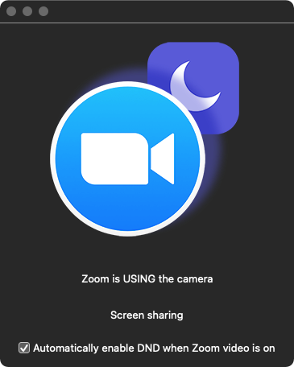

# isZoomUsingCamera

Simple SwiftUI app that checks if Zoom is actively using the camera.

Can automatically toggle Do Not Disturb based on when zoom is using the camera.

# Usage

There aren't any provided builds yet.

You need to run this application with sudo / root access, so it can access Zoom.
