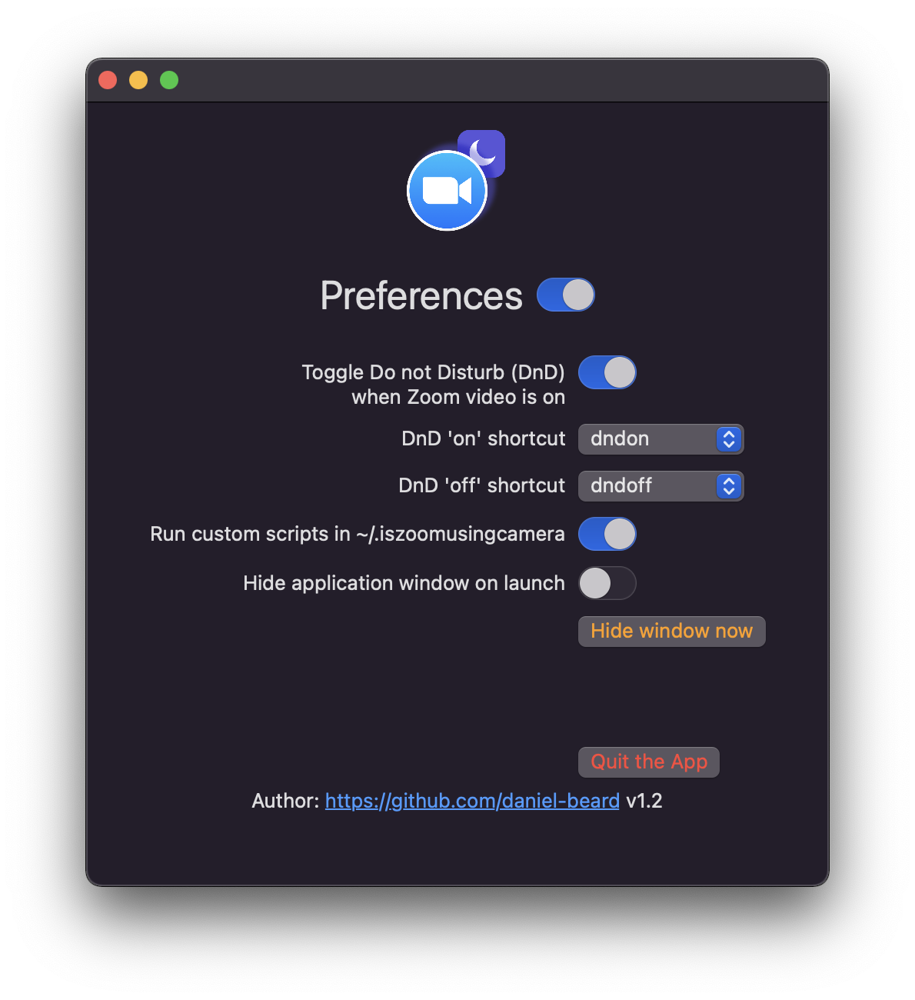

# isZoomUsingCamera

Simple SwiftUI app that checks if Zoom is actively using the camera.

Can automatically toggle Do Not Disturb based on when zoom is using the camera.


# Usage

There aren't any provided builds yet.

# Setting up do not disturb

Note: Do not disturb settings only take effect when the preference: `Automatically enable DND when Zoom video is on` is set.

## Monterey and newer

Use shortcuts. Setup two shortcuts within the Shortcuts.app. 

In the examples below, I've named these `dndon` and `dndoff`:


Now you can select and save the shortcut names for each do not disturb action in the preferences:



## Big Sur

TODO: Coming soon

# Custom Scripts

There are a few events that can trigger custom scripts if you choose. You must enable the preference: `Run custom scripts in ~/.iszoomusingcamera` for the following to take effect.
Remember to make these scripts user executable with `chmod +x ~/.iszoomusingcamera/{name of file}`.

| Event | Path to script |
| --------------- | --------------- |
| Application started | `~/.iszoomusingcamera/app_started.sh` |
| Application ended | `~/.iszoomusingcamera/app_ended.sh` |
| Camera enabled | `~/.iszoomusingcamera/camera_enabled.sh` |
| Camera disabled | `~/.iszoomusingcamera/camera_disabled.sh` |
| Screen sharing started | `~/.iszoomusingcamera/screen_sharing_started.sh` |
| Screen sharing ended | `~/.iszoomusingcamera/screen_sharing_ended.sh` |

## Custom Script Example

Here's some example scripts that I use. You'll need to `brew install terminal-notifier` for this to work. Note: paths are correct for M1 machines, if you are on x86_64, change these to `/usr/local/bin/`:

`~/.iszoomusingcamera/camera_enabled.sh`:

```bash
#!/bin/bash

/opt/homebrew/bin/terminal-notifier -title "isZoomUsingCamera" \
  -message "Camera was STARTED" \
  -contentImage "https://raw.githubusercontent.com/daniel-beard/isZoomUsingCamera/master/isZoomUsingCamera/Assets.xcassets/AppIcon.appiconset/icon_128.png" \
```

`~/.iszoomusingcamera/camera_disabled.sh`:

```bash
#!/bin/bash

/opt/homebrew/bin/terminal-notifier -title "isZoomUsingCamera" \
  -message "Camera was STOPPED" \
  -contentImage "https://raw.githubusercontent.com/daniel-beard/isZoomUsingCamera/master/isZoomUsingCamera/Assets.xcassets/AppIcon.appiconset/icon_128.png" \
```

So I get notifications when the camera starts or stops:


